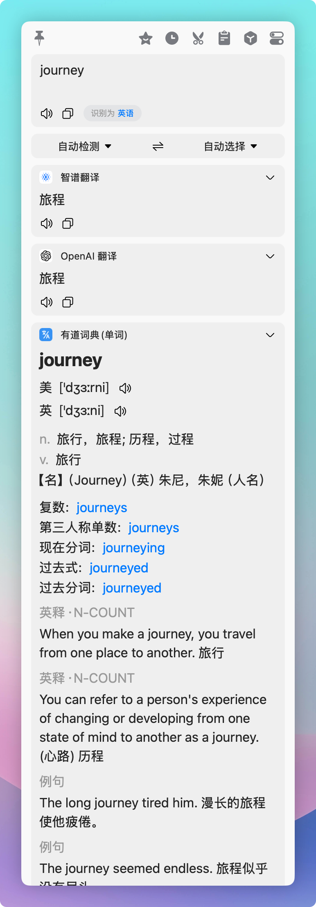

# 有道词典(单词) Bob 翻译插件

[](https://github.com/kindtree/bob-plugin-youdaodict/actions/workflows/test.yml)
[](https://github.com/kindtree/bob-plugin-youdaodict/releases/latest)
[](./LICENSE)

[Bob](https://bobtranslate.com/) 的有道词典翻译插件。划词查**单个英文单词**时返回完整词典(释义/发音/例句/近义/词组/英释/星级/考试标签);**1-4 个汉字**反向查英文候选(按词性分组,可点);**整句中文**返回翻译并把句中内容词列成可点列表(过滤停用词,点任意词跳查完整词典)。无需任何 key,直接用有道公开接口。

<p align="center">
  
</p>

## 解决什么问题

Bob 自带的金山词霸经常提示"没有查到此单词",尤其是六级以上、考研、专业领域词。本插件换用有道作为数据源,词库覆盖明显更全;同时把发音、例句、英释、相关词、考试标签等都一次性渲染出来,看一次词等于查了好几本词典。

## 突出功能

数据足够多:

- 中文释义按词性分组
- 柯林斯英文释义(可在设置中关闭)
- 双语例句(柯林斯简洁例句优先,过长例句自动让位短句,解决冷门词例句过长的问题)
- 同义词按词性分组
- 常用词组,如 `good at 善于`
- 同根衍生词,按词性分组渲染到 Bob 的 `relatedWordParts`
- 词形变化(复数 / 比较级 / 最高级 等)
- 词频星级(柯林斯五星制,一眼看出常用度)
- 考试标签(CET4 / CET6 / 考研 等)

发音体验好:

- 英美双发音都可点喇叭出声(有道 dictvoice 真人音源,无需 key)
- 设置里可选美式优先或英式优先(影响默认朗读项)

划词更宽容:

- 划词常把句号、引号一起选中,本插件会自动去除前后非字母字符。`good.`、`"good"`、`(well-being)` 都能直接查到
- **中文短词反查英文**:划 `影响` 看到 `n. influence / effect`、`vt. affect / impact / impress`,点任意英文词跳查完整词典
- **中文整句翻译**:划 `今天天气不错` 看到主译 `The weather is good today.` + 备选译法,以及句中可点词 `weather / good / today`

工程上更扎实:

- 本地缓存 7 天,同词秒出
- 网络失败自动重试一次,接口偶发抖动也能撑过去
- 缓存层全程 try/catch 兜底,任何文件层异常都退回联网,不影响查词
- 解析逻辑全部由 `node --test` 用真实抓取的有道响应做夹具覆盖,44 个单测

不上传、零依赖:

- 所有请求直接打有道公开接口,本插件不上传任何东西
- 不需要 API key、不需要登录、不需要 npm 包

## 安装

下载并安装:

1. 到 [Releases](https://github.com/kindtree/bob-plugin-youdaodict/releases/latest) 下载最新的 `youdaodict.bobplugin`
2. 双击安装,Bob 偏好设置 → 服务 中启用"有道词典(单词)"
3. 把它拖到翻译服务列表靠前的位置,这样划词会优先用它

或从源码自行打包:

```bash
git clone https://github.com/kindtree/bob-plugin-youdaodict.git
cd bob-plugin-youdaodict
bash build.sh   # 产出 youdaodict.bobplugin,双击即可安装
```

## 配置

插件设置里有三个开关:

| 设置 | 选项 | 默认 |
|---|---|---|
| 发音口音优先 | 美式 / 英式 | 美式 |
| 例句数量 | 1 / 2 / 3 条 | 2 条 |
| 柯林斯英文释义 | 显示 / 隐藏 | 显示 |

## 路线图

下一步打算做的事:

- 音频本地缓存(目前每次点喇叭都会拉一次音频,频繁点同一个词时偏吃流量)
- 多音源兜底,dictvoice 失败时切到备用 TTS
- 可选的有道官方 API 路线(填 AppID / Secret),合规且不怕被反爬限频
- 同根词渲染样式优化
- 自定义图标(Bob 自定义图片图标尚无官方文档,在等社区方案)

## 反馈与贡献

这个插件还在打磨,欢迎在 [Issues](https://github.com/kindtree/bob-plugin-youdaodict/issues) 里:

- **提需求**:你想要的字段、想要的排版、想关掉的内容,都可以提
- **报问题**:某个词查出来不对、发音不出声、配置没生效、和某个翻译服务冲突
- **谈体验**:信息密度、配色、行距、什么放前什么放后,这些主观项也很重要

直接发 PR 也欢迎。提 Issue 时附上具体单词、Bob 版本、系统版本,定位会快很多。

## 开发

```bash
node --test tests/*.test.js   # 跑单测,零依赖,Node 20+ 自带 runner
bash build.sh                 # 打包 .bobplugin
bash release.sh               # 打包 + 把 sha256 写回 appcast.json
```

代码分两层:纯函数(有道 jsonapi 响应 → Bob `toDict` 结构)+ 薄胶水(`translate` / `$http` / `$file` / `$option`)。所有纯函数都用真实抓取的有道响应做夹具单测。

技术细节(Bob 沙箱注入的全局对象、有道字段路径表、发音 URL、TDD / 打包 / appcast 流程、新建插件起步清单)见 [DEVELOPMENT.md](./DEVELOPMENT.md)。

## 免责声明

本插件使用有道公开的词典与发音接口(`dict.youdao.com/jsonapi`、`dict.youdao.com/dictvoice`),仅供个人学习使用。这些接口为非官方公开接口,任何变更或访问限制均由有道决定。请勿用于批量抓取等高频用途。

## 更新日志

见 [CHANGELOG.md](./CHANGELOG.md)。

## License

[MIT](./LICENSE) © 2026 Alex Lee

参考与致敬:[xingty/bob-plugin-youdao-dict-enhance](https://github.com/xingty/bob-plugin-youdao-dict-enhance)(同根衍生词、考试标签的字段路径参考了该项目)。
