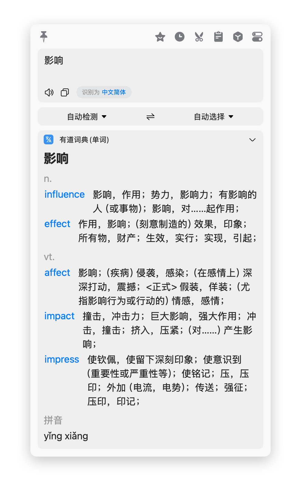
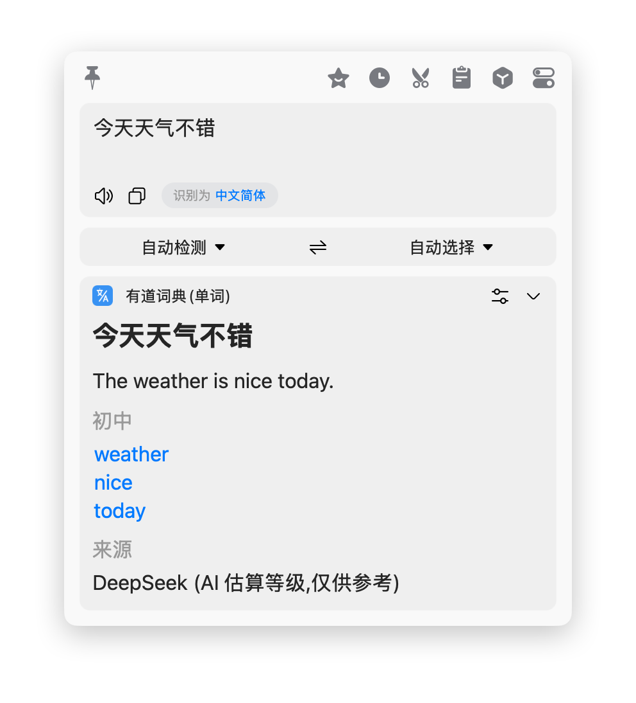
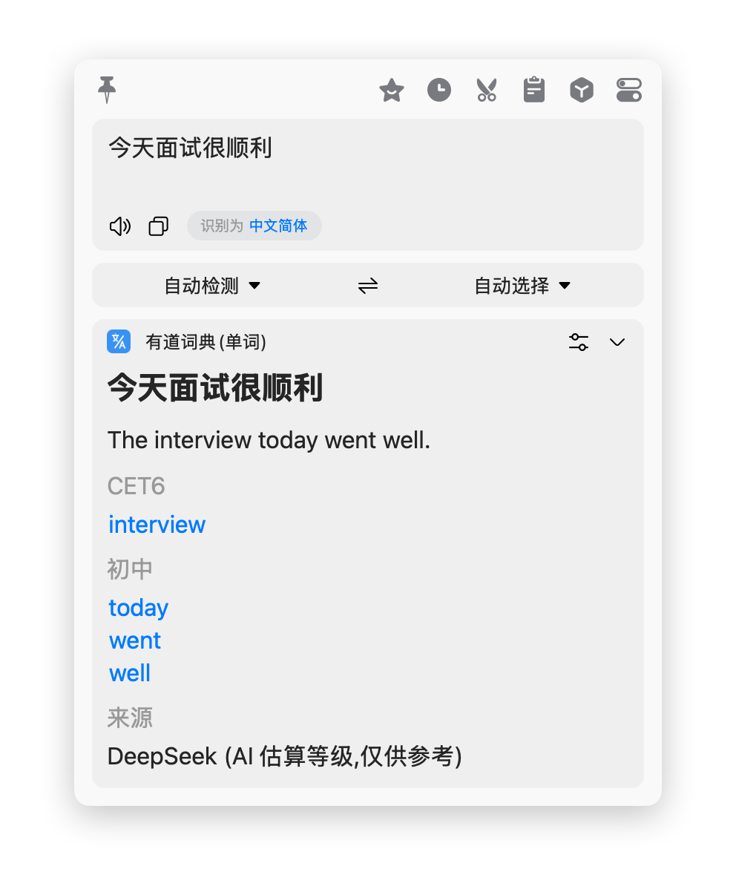
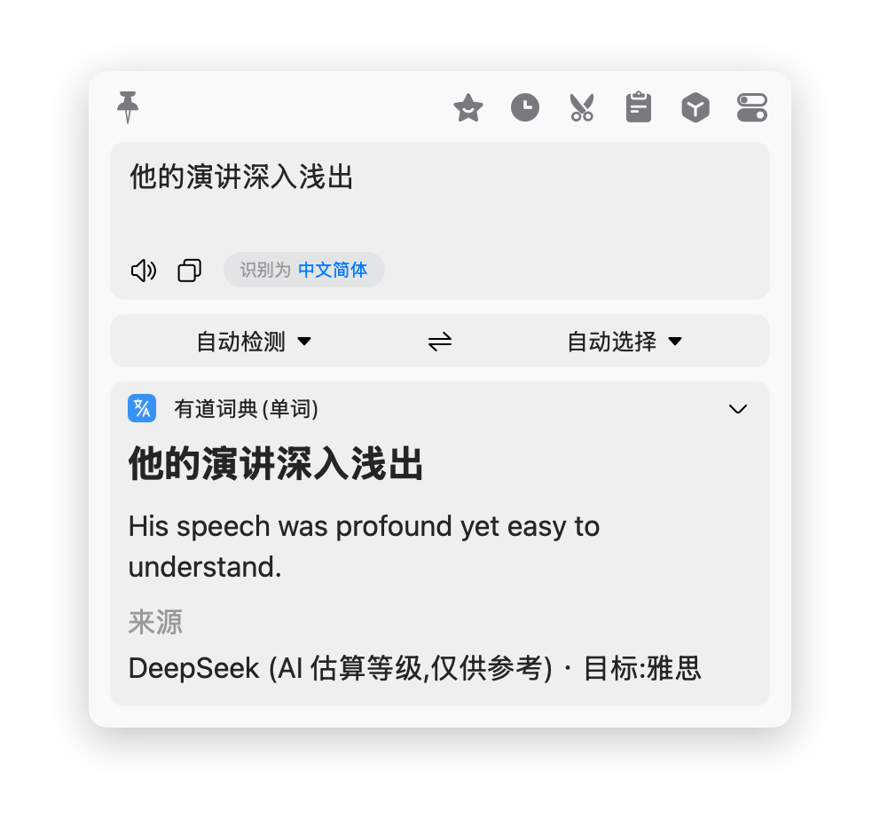
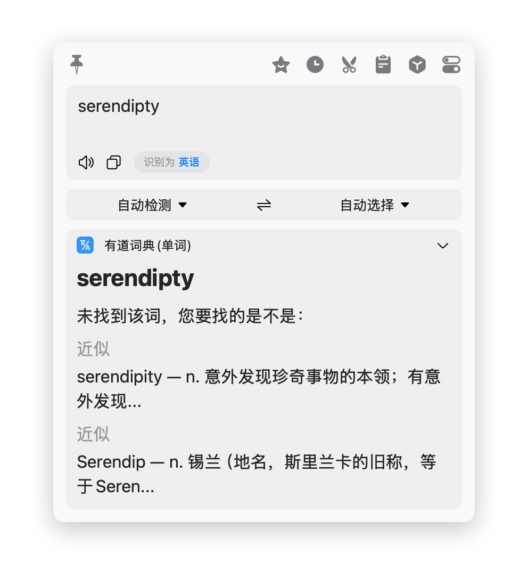
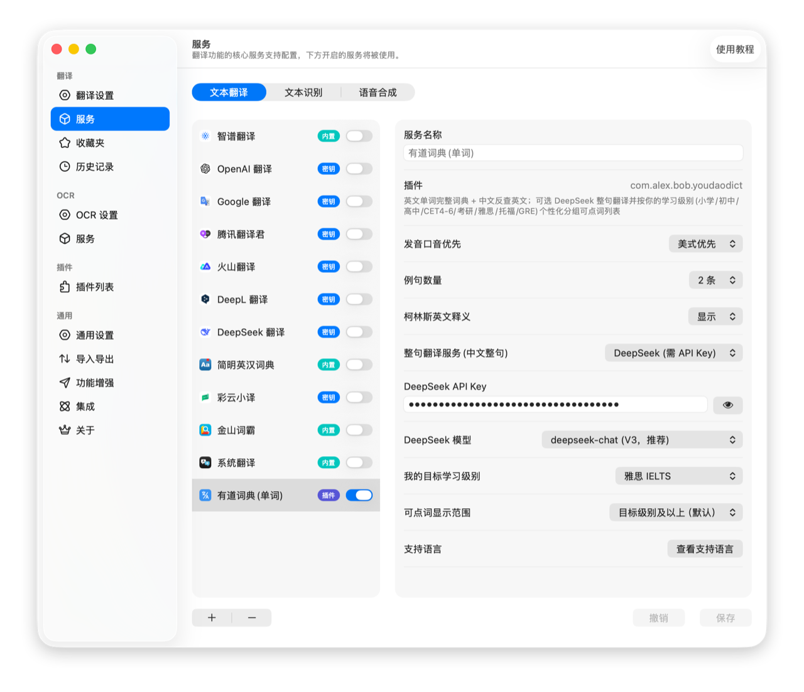

# 有道词典(单词) Bob 翻译插件

[](https://github.com/kindtree/bob-plugin-youdaodict/actions/workflows/test.yml)
[](https://github.com/kindtree/bob-plugin-youdaodict/releases/latest)
[](./LICENSE)

[Bob](https://bobtranslate.com/) 的有道词典翻译插件。划词查**单个英文单词**时返回完整词典(释义/发音/例句/近义/词组/英释/星级/考试标签);**1-4 个汉字**反向查英文候选(按词性分组,可点);**整句中文**返回翻译并把句中内容词列成可点列表(过滤停用词,点任意词跳查完整词典)。无需任何 key,直接用有道公开接口。

<p align="center">
  
</p>

## 解决什么问题

Bob 自带的金山词霸经常提示"没有查到此单词",尤其是六级以上、考研、专业领域词。本插件换用有道作为数据源,词库覆盖明显更全;同时把发音、例句、英释、相关词、考试标签等都一次性渲染出来,看一次词等于查了好几本词典。

## 突出功能

### 一. 英文单词词典(核心,免 key)

- 中文释义按词性分组、英美双发音(点喇叭真人出声,有道 dictvoice 音源)
- **双语例句**(柯林斯简洁例句优先,长例句自动让位短句,解决冷门词例句过长)
- **柯林斯英文释义**(可在设置中关闭)
- **同义词**(按词性分组)、**常用词组**(`good at 善于`)
- **同根衍生词**:按词性渲染到 `relatedWordParts`,蓝色可点跳查
- **词形变化**(复数 / 比较级 / 最高级)、**词频星级**(柯林斯五星制)、**考试标签**(CET4/CET6/考研 等)
- **拼错候选**:`serendipty` → `serendipity / Serendip`,不再"未查询到"

### 二. 中文反查英文(免 key)

- **1-4 个汉字反查**:划 `影响` 看到 `n. influence / effect`、`vt. affect / impact / impress`,英文蓝字可点跳查完整词典
- **常见短句翻译**(jsonapi 词典收录的常用搭配):划 `今天天气不错` 得到主译 + 2 条备选译法 + 句中可点词

<details>
<summary>📸 看看实际效果(中文短词反查"影响")</summary>

<p align="center"></p>

</details>

### 三. 任意整句翻译 + 学习者个性化(可选,需 DeepSeek key)

- **LLM 翻译任意中文句**:即使是 `今天面试很顺利` 这种冷门口语句也能翻,不再回退
- **按考试等级分组的可点词列表**:翻译里的内容词按 `小学 / 初中 / 高中 / CET4 / CET6 / 考研 / 雅思 / 托福 / GRE` 共 10 档分组,蓝色可点跳查;**学英语的人一眼看出哪些词是自己目标考试范围**
- **按你的学习级别个性化(v1.8+)**:在设置里选目标级别(雅思 / 考研 / CET6 等),LLM 翻译会**倾向使用该级别的常考词汇**(避免给雅思学生用全 GRE 难词,也避免给小学生用大学词);可点词列表默认只显示"目标级别及以上",把视线集中在该学的词上
- **失败自动兜底**:LLM 不可用时回退 jsonapi 词典模式,用户始终有结果

<details>
<summary>📸 看看实际效果(LLM 翻译 + 等级分组 + 学习者个性化)</summary>

<table>
<tr>
<td align="center" width="33%">
<br>
<sub><b>LLM 翻译</b>:今天天气不错 → 词都在初中级</sub>
</td>
<td align="center" width="33%">
<br>
<sub><b>等级分组</b>:今天面试很顺利 → interview 是 CET6,today/went/well 是初中</sub>
</td>
<td align="center" width="33%">
<br>
<sub><b>个性化</b>:目标选雅思,LLM 选词用 <code>profound yet easy to understand</code>;简单词被过滤</sub>
</td>
</tr>
</table>

</details>

### 四. 输入更宽容、缓存与重试

- 划词常把句号引号一起选中:`good.`、`"good"`、`(well-being)` 都能直接查
- **拼错也能查**:`serendipty` → "您要找的是不是: serendipity / Serendip" + 简短释义
- **本地缓存 7 天**,同词秒出;**网络失败自动重试一次**,接口偶发抖动撑得过去
- 缓存层全程 try/catch 兜底,任何文件层异常都退回联网,绝不影响查词

<details>
<summary>📸 看看实际效果(拼错词候选)</summary>

<p align="center"></p>

</details>

### 五. 工程上扎实

- **真实数据 TDD**:解析逻辑由 `node --test` 用真实抓取的有道响应做夹具覆盖,**78 个单测**
- **GitHub Actions CI**:每次推送自动跑全部测试,绿则发版
- 代码分两层:纯函数 + 薄胶水,Bob 沙箱注入的 `$http`/`$file`/`$option` 全在胶水层

### 六. 隐私与定位

- **核心词典功能零 key**:英文查词、中文反查、jsonapi 整句翻译,直接打有道公开接口,不需登录、不需 npm 依赖
- **可选解锁**:LLM 整句翻译需要用户自填 DeepSeek key(默认关闭);不开启时保持纯免费免 key
- 不上传任何东西到第三方分析平台

<details>
<summary>📸 设置界面预览</summary>

<p align="center"></p>

<sub>所有设置项:发音口音 / 例句数量 / 柯林斯英释开关 / 整句翻译服务 / DeepSeek key + 模型 / 我的目标学习级别 / 可点词显示范围</sub>

</details>

## 安装

下载并安装:

1. 到 [Releases](https://github.com/kindtree/bob-plugin-youdaodict/releases/latest) 下载最新的 `youdaodict.bobplugin`
2. 双击安装,Bob 偏好设置 → 服务 中启用"有道词典(单词)"
3. 把它拖到翻译服务列表靠前的位置,这样划词会优先用它

或从源码自行打包:

```bash
git clone https://github.com/kindtree/bob-plugin-youdaodict.git
cd bob-plugin-youdaodict
bash build.sh   # 产出 youdaodict.bobplugin,双击即可安装
```

## 配置

插件设置里:

| 设置 | 选项 | 默认 |
|---|---|---|
| 发音口音优先 | 美式 / 英式 | 美式 |
| 例句数量 | 1 / 2 / 3 条 | 2 条 |
| 柯林斯英文释义 | 显示 / 隐藏 | 显示 |
| 整句翻译服务 | 关闭 / DeepSeek | 关闭 |
| DeepSeek API Key | (secure 文本) | 空 |
| DeepSeek 模型 | deepseek-chat / deepseek-reasoner | deepseek-chat |
| 我的目标学习级别 | 不偏好 / 小学 / 初中 / 高中 / CET4 / CET6 / 考研 / 雅思 / 托福 / GRE | 不偏好 |
| 可点词显示范围 | 目标级别及以上 / 仅目标级别 / 全部级别 | 目标级别及以上 |

### 开启 DeepSeek 整句翻译(可选,beta)

1. 去 https://platform.deepseek.com 注册账号,新人送 ¥5 额度(够上千次翻译)
2. 在控制台 API Keys 创建一把 key,形如 `sk-xxxxxx`
3. Bob 偏好设置 → 服务 → 找到本插件 → 上面表里把"整句翻译服务"切到 DeepSeek,粘 key
4. 划任意中文句,会看到 LLM 翻译 + 按考试等级分组的可点词列表

> 说明:LLM 等级估算非权威,会漂移;开启后每次划词消耗 ~¥0.001。不开启时保持 v1.6 行为(jsonapi 词典模式,免费免 key)。

### 按个人学习级别使用(v1.8+)

选好 `我的目标学习级别` 后:
- LLM 翻译时会**偏向使用该级别常考词汇**(避免给学雅思的人翻译成全是 GRE 难词,也避免给小学生翻成大学水平)
- `可点词显示范围`默认"目标级别及以上",意思是"我的级别 + 比我更难的",简单的词不显示,把注意力集中在该学的词上
- 想看所有难度,把范围设为"全部级别"
- 想只盯一档,设为"仅目标级别"

## 路线图

下一步打算做的事:

- 音频本地缓存(目前每次点喇叭都会拉一次音频,频繁点同一个词时偏吃流量)
- 多音源兜底,dictvoice 失败时切到备用 TTS
- 可选的有道官方 API 路线(填 AppID / Secret),合规且不怕被反爬限频
- 同根词渲染样式优化
- 自定义图标(Bob 自定义图片图标尚无官方文档,在等社区方案)

## 反馈与贡献

这个插件还在打磨,欢迎在 [Issues](https://github.com/kindtree/bob-plugin-youdaodict/issues) 里:

- **提需求**:你想要的字段、想要的排版、想关掉的内容,都可以提
- **报问题**:某个词查出来不对、发音不出声、配置没生效、和某个翻译服务冲突
- **谈体验**:信息密度、配色、行距、什么放前什么放后,这些主观项也很重要

直接发 PR 也欢迎。提 Issue 时附上具体单词、Bob 版本、系统版本,定位会快很多。

## 开发

```bash
node --test tests/*.test.js   # 跑单测,零依赖,Node 20+ 自带 runner
bash build.sh                 # 打包 .bobplugin
bash release.sh               # 打包 + 把 sha256 写回 appcast.json
```

代码分两层:纯函数(有道 jsonapi 响应 → Bob `toDict` 结构)+ 薄胶水(`translate` / `$http` / `$file` / `$option`)。所有纯函数都用真实抓取的有道响应做夹具单测。

技术细节(Bob 沙箱注入的全局对象、有道字段路径表、发音 URL、TDD / 打包 / appcast 流程、新建插件起步清单)见 [DEVELOPMENT.md](./DEVELOPMENT.md)。

## 免责声明

本插件使用有道公开的词典与发音接口(`dict.youdao.com/jsonapi`、`dict.youdao.com/dictvoice`),仅供个人学习使用。这些接口为非官方公开接口,任何变更或访问限制均由有道决定。请勿用于批量抓取等高频用途。

## 📸 截图全集

<table>
<tr>
<td align="center" width="33%">
<br>
<sub><b>1. 英文单词完整词典</b><br>音标 / 双发音 / 词性释义 / 词形 / 词频 / 标签 / 英释 / 例句 / 近义 / 词组</sub>
</td>
<td align="center" width="33%">
<br>
<sub><b>2. 中文短词反查英文</b><br>「影响」→ 按词性分组的英文候选,蓝字可点</sub>
</td>
<td align="center" width="33%">
<br>
<sub><b>3. 拼错候选</b><br>「serendipty」→ 您要找的是不是: serendipity</sub>
</td>
</tr>
<tr>
<td align="center" width="33%">
<br>
<sub><b>4. LLM 整句翻译</b><br>常见句翻译 + 可点词列表</sub>
</td>
<td align="center" width="33%">
<br>
<sub><b>5. 按考试等级分组</b><br>「今天面试很顺利」→ CET6 vs 初中 分组</sub>
</td>
<td align="center" width="33%">
<br>
<sub><b>6. 学习者级别个性化</b><br>目标=雅思,LLM 选词更高级,简单词被过滤</sub>
</td>
</tr>
<tr>
<td align="center" colspan="3">
<br>
<sub><b>7. 设置界面</b><br>口音/例句数/柯林斯/DeepSeek key/目标级别/显示范围</sub>
</td>
</tr>
</table>

## 更新日志

见 [CHANGELOG.md](./CHANGELOG.md)。

## License

[MIT](./LICENSE) © 2026 Alex Lee

参考与致敬:[xingty/bob-plugin-youdao-dict-enhance](https://github.com/xingty/bob-plugin-youdao-dict-enhance)(同根衍生词、考试标签的字段路径参考了该项目)。
